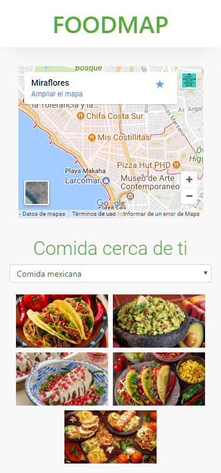
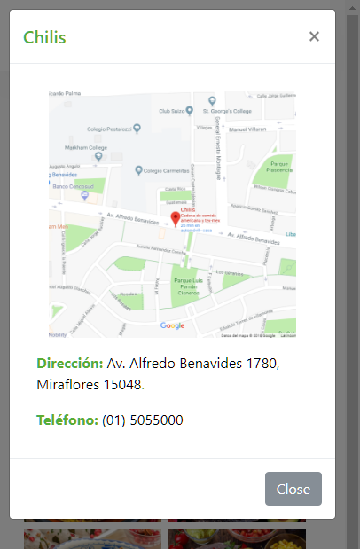

## **FOODMAP**

#### OBJETIVO:
Desarrollar una web-app que a través de un input pueda filtrar los restaurantes que se encuentran cerca de ti , como se muestra a continuación:

#### DETALLES DEL REPOSITORIO:
+ Para la visualización de la vista splash y la vista principal se crearon para cada una un archivo *html*. La vista principal se encuentran en la carpeta *views*.
+ Para la funcionalidad en cada archivo se creo archivos *javascript* independientes para cada vista.
+ Tambien se creo un archivo *data.js* en el cual se encuentran la informción de los restaurantes incluidos en el proyecto.
+ Se utilizó el framework *BOOTSTRAP* para el diseño y los modales incluidos en el proyecto.